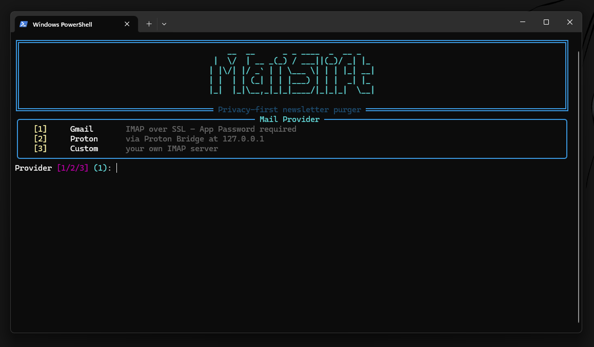
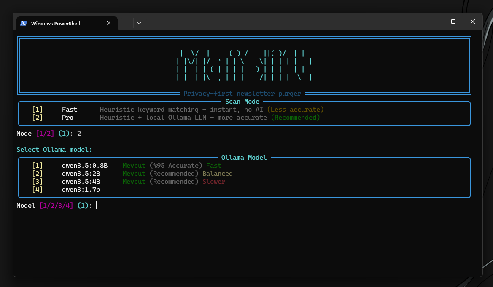

# MailShift

Privacy-first newsletter & junk mail cleaner for Gmail and Proton Mail.

## Screenshots

### Welcome Screen



### Fast/Pro Mode and AI Model Selection



## Features

- **Multi provider support**: Gmail (IMAP + App Password), Proton Mail (Requires [Proton Bridge](https://proton.me/mail/bridge) and a paid account), and Custom IMAP servers
- **Attachment protection**: Emails with attachments are never deleted
- **Fast-mode safety guards**: Premium lifecycle expiry notices, verification code (OTP) emails, and Google Drive/cloud storage fullness alerts are force-kept in Fast mode before junk checks
- **Fast-mode false-positive reduction**: Blacklist matching excludes the sender address so legitimate automated senders (e.g. `no-reply@github.com`) never trigger a junk decision; whitelist and safety-guard still consider the full sender context
- **Turkish case normalization**: Fast-mode text is normalized (Turkish İ → i) before heuristic matching, fixing missed matches on properly-capitalised Turkish subjects
- **Two scan modes**:
  - `fast` – heuristic keyword matching (blacklist/whitelist)
  - `pro`  – two-phase analysis: heuristic + local Ollama LLM for smarter detection
    - Phase 1: Fast heuristic scan
    - Phase 2: LLM verification on suspicious messages
        - Robust decision parser accepts `SIL/TUT` text or JSON-style outputs and normalizes Turkish `SİL/SIL` variants
        - Ollama call uses `/api/chat` with structured JSON decision output for better small-model reliability
        - Pro mode disables model "thinking" output and uses a larger generation budget to prevent empty decision responses on 2B/4B models
- **Body preview in Pro mode**: Fetches email body content for better LLM analysis
- **Dry-run default** – preview before any deletion
- **Credential memory** – can save IMAP e-mail/app password locally and ask whether to reuse previous credentials on next run
- **Delete options**: Permanent delete or move to Trash
- **Resilient IMAP deletion**: Delete/trash chunks and expunge retry with exponential back-off and automatic IMAP reconnect on SSL/EOF disconnects
- **Concurrent fetching** – multi-threaded IMAP operations
- **Auto worker calculation** – automatically calculates optimal thread count based on hardware
    - Detects NVIDIA GPUs and Intel/AMD GPUs on Windows for Pro mode worker sizing
    - Intel/AMD integrated GPU VRAM may be estimated from shared system RAM when dedicated VRAM is not exposed by the driver
- **Cache support** – skip re-fetching headers on repeat scans
- **Rich CLI UI** – progress bars, tables, colored output with Turkish/English
    - Progress status labels are sanitized and shortened to stay single-line on narrow terminals (prevents duplicated-looking bars)
    - Live progress uses ASCII status tags (`SIL`/`TUT`) for more stable rendering across Windows terminals
- **Cleanup history** – view past deletion reports
- **Logging** – detailed operation logs
    - Console warnings/errors are written to stderr to reduce interference with live progress rendering

## Install

```bash
pip install -r requirements.txt
```

## Usage

```bash
# Interactive mode
python main.py

# Non-interactive
python main.py --provider gmail --mode fast \
    --username you@gmail.com --password "app-password"

# Custom IMAP server
python main.py --provider custom --mode fast \
    --username you@example.com --password "your-password" \
    --host imap.example.com --port 993

# Pro mode with LLM (two-phase analysis)
python main.py --provider gmail --mode pro \
    --username you@gmail.com --password "app-password"

# Real deletion (disable dry-run)
python main.py --provider gmail --mode pro \
    --username you@gmail.com --password "app-password" --no-dry-run

# Move to Trash instead of permanent delete
# (select option 2 when prompted)

# View cleanup history
python main.py --history

# Export scan results to CSV (before deletion)
python main.py --provider gmail --mode fast \
    --username you@gmail.com --password "app-password" \
    --export results.csv

# Export to JSON
python main.py --provider gmail --mode fast \
    --username you@gmail.com --password "app-password" \
    --export results.json

# Custom Ollama settings
python main.py --provider gmail --mode pro \
    --username you@gmail.com --password "app-password" \
    --ollama-url http://localhost:11434 \
    --ollama-model qwen3.5:2B

# Custom system prompt for LLM
python main.py --provider gmail --mode pro \
    --username you@gmail.com --password "app-password" \
    --ollama-prompt "Custom prompt here"
```

## Options

| Flag | Description | Default |
|------|-------------|---------|
| `--provider` | `gmail`, `proton` or `custom` | prompt |
| `--mode` | `fast` or `pro` | prompt |
| `--username` | IMAP email/username | prompt |
| `--password` | App Password / Bridge password | prompt |
| `--host` | Custom IMAP server host | - |
| `--port` | Custom IMAP server port | 993 |
| `--use-ssl` | Use SSL for IMAP | enabled |
| `--dry-run` | Preview only (no deletion) | enabled |
| `--no-dry-run` | Actually delete emails | - |
| `--scan-limit` | Max messages to scan | all |
| `--ollama-url` | Ollama API URL | `http://localhost:11434` |
| `--ollama-model` | Ollama model | `qwen3.5:2B` |
| `--ollama-prompt` | Custom system prompt for LLM | default prompt |
| `--history` | Show cleanup history | - |
| `--export` | Export results to CSV/JSON | - |
| `--uninstall` | Remove MailShift from system | - |

## Credential Reuse

- In interactive credential flow, MailShift can store credentials in local `credentials.json` (project root, provider-based).
- On later runs, if saved credentials exist, it asks whether to reuse previous values.
- You can still override credentials anytime via `--username` and `--password` flags.

## Keyword Management

Manage whitelist and blacklist keywords directly from CLI:

```bash
# Add a keyword to whitelist
python main.py --add-whitelist "fatura"

# Remove a keyword from whitelist
python main.py --remove-whitelist "fatura"

# Add a keyword to blacklist
python main.py --add-blacklist "spam"

# Remove a keyword from blacklist
python main.py --remove-blacklist "spam"

# List all keywords
python main.py --list-keywords
```

## How It Works

1. **Connect** – IMAP authentication to inbox
2. **Fetch** – retrieve email headers (concurrent), body for Pro mode
3. **Analyze**:
    - Fast: whitelist-first flow (`whitelist.json` match => `TUT`), then suspicious check via `blacklist.json` (`SIL`)
    - Plus built-in safety guards that force `TUT` for premium expiry lifecycle notices, verification-code mails, and Drive/cloud storage quota-full alerts
   - Pro: two-phase analysis
     - Phase 1: heuristic scan to find suspicious messages
     - Phase 2: run matched mail through Ollama LLM for verification
4. **Review** – table of messages marked for deletion
5. **Delete** – permanent delete or move to Trash (empty Trash to permanent delete)
    - Delete/trash operations automatically retry transient IMAP/SSL socket failures and reconnect before retrying

## Files

```
main.py           CLI entry point
engine.py         IMAP engine + cache
config.py         Config models + keyword patterns
models.py         Data classes
hardware.py       System info + worker calculation
fast_analyzer.py  Heuristic analysis
pro_analyzer.py   LLM analysis (Ollama)
database.py       Cache storage (SQLite)
history.py        Cleanup history + export
logger.py         Logging utilities
ui.py             Rich UI components
cli_utils.py      CLI helper functions
blacklist.json    Keywords → mark for deletion
whitelist.json   Keywords → always keep
```

## Gmail App Password

1. Enable 2-Factor Authentication
2. Go to https://myaccount.google.com/apppasswords
3. Generate 16-char password for Mail

## Proton Bridge

Run Proton Bridge locally, then connect with bridge credentials.

## Requirements

- Python 3.10+
- IMAP access to your email provider
- For Pro mode: [Ollama](https://ollama.com) running locally.
    - On Windows with Intel GPU, MailShift starts `ollama serve` with `OLLAMA_INTEL_GPU=1` (when auto-start is used) and requests higher GPU layer offload in Pro mode to reduce unintended CPU-only inference.
    - Intel/AMD GPU acceleration still depends on Ollama backend support/driver stack; if Ollama cannot offload, inference can continue on CPU even when MailShift detects the GPU.
  - **Power User Tip**: Set the `OLLAMA_NUM_PARALLEL` environment variable to increase concurrent workers (default is 4).
  - **Note**: To close Ollama completely on Windows, you must use the Task Manager as it often runs without a visible window or system tray icon.

## Ollama Kurulduktan Sonra Ne Yapmalıyım?

Pro mode seçiminde Ollama yüklü değilse MailShift otomatik kurulum önerebilir. Kurulum bittiğinde Pro mode'a devam edebilmek için şu adımları izleyin:

1. Terminali kapatıp yeniden açın (PATH güncellemesi için).
2. Ollama servisini başlatın: `ollama serve`
3. MailShift'i yeniden çalıştırıp Pro mode seçin.
4. Model seçim ekranında eksik önerilen model otomatik indirilir (manuel `ollama pull` gerekmez).

Not: Uygulama bu adımları ayrıca panel olarak da gösterir ve otomatik başlatma denemesi yapar. Otomatik başlatma başarısız olursa Fast mode'a güvenli şekilde geri döner.

Not: Önerilen modeller listesine `qwen3.5:0.8B` eklidir ve seçim ekranında `%95 Accurate` etiketiyle gösterilir.

## Tests

- Run all tests with: `py -3.14 -m pytest tests/`
- Gmail delete and move-to-trash flows are covered in `tests/test_google_delete_trash.py`.
