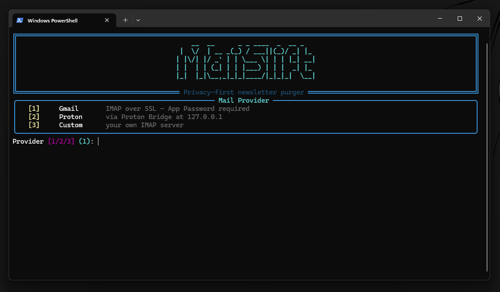
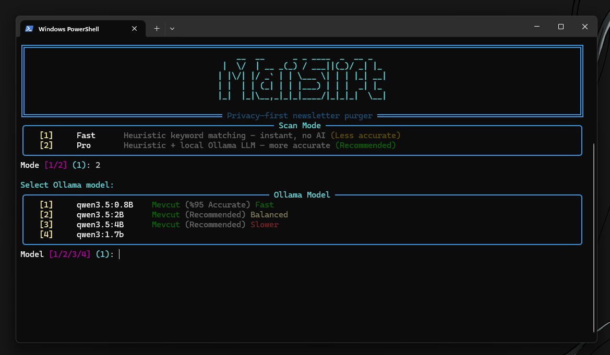

# MailShift

<div align="center">

**Privacy-first newsletter & junk mail cleaner for Gmail, Proton Mail, and IMAP.**  
Clean your inbox with lightning-fast heuristic matching or local AI verification (Ollama & LM Studio). Zero telemetry, 100% local, dry-run by default.

[](https://pypi.org/project/mailshift/)
[](https://pypi.org/project/mailshift/)
[](LICENSE)
[](#privacy--safety-first)

</div>

---

## Table of Contents

- [Screenshots](#screenshots)
- [Key Features](#key-features)
- [Quick Start](#quick-start)
- [Installation](#installation)
- [Email Provider Setup](#email-provider-setup)
  - [Gmail Setup](#gmail-setup)
  - [Proton Mail Setup (⚠️ Paid Account Required)](#proton-mail-setup)
  - [Custom IMAP](#custom-imap-setup)
- [Scan Modes & Local AI](#scan-modes--local-ai)
  - [Fast Mode (Heuristic)](#fast-mode)
  - [Pro Mode (Hybrid Local AI)](#pro-mode)
  - [Setting up Ollama / LM Studio](#setting-up-ollama--lm-studio)
- [CLI Usage & Examples](#cli-usage--examples)
- [CLI Options Reference](#cli-options-reference)
- [Keyword Customization](#keyword-customization)
- [One-Click Unsubscribe Assistant](#one-click-unsubscribe-assistant)
- [Project Architecture](#project-architecture)
- [Privacy & Safety Guarantees](#privacy--safety-guarantees)
- [License](#license)

---

## Screenshots

### Welcome Screen


### Fast / Pro Mode and AI Model Selection


---

## Key Features

- 📬 **Multi-Provider Support**:
  - **Gmail**: IMAP with secure Google App Passwords.
  - **Proton Mail**: Local IMAP integration via Proton Mail Bridge (*Paid subscription required*).
  - **Custom IMAP**: Works with any standard IMAP server (SSL / non-SSL).
- ⚡ **Dual Scan Engines**:
  - **Fast Mode**: Blazing-fast keyword matching (`blacklist.json` & `whitelist.json`) with Turkish case normalization (`İ` → `i`).
  - **Pro Mode**: Two-phase hybrid analysis — heuristic pre-filtering followed by local LLM validation (Ollama or LM Studio) with structured JSON decision output (`SIL` / `TUT`).
- 🛡️ **Safety-First Architecture**:
  - **Dry-run by default**: No email is deleted or moved unless explicitly requested (`--no-dry-run`).
  - **Attachment Protection**: Emails with attachments are strictly preserved and never flagged for deletion.
  - **Heuristic Keep-Guards**: Automatically protects 2FA/OTP codes, account renewal notices, and cloud storage quota alerts.
  - **OS Keyring Integration**: Securely encrypts and saves credentials via Windows Credential Manager, macOS Keychain, or Linux Secret Service with Pydantic `SecretStr`. No plaintext credentials stored on disk.
- 📩 **Interactive Unsubscribe Assistant**:
  - Automatically extracts `List-Unsubscribe` headers (RFC 8058 one-click POST & GET).
  - Allows 1-click batch unsubscribe, selective sender unsubscribe, or exporting links to JSON/TXT.
- 🚀 **Intelligent Hardware Tuning**:
  - Auto-detects NVIDIA GPUs as well as Intel/AMD GPUs on Windows and Linux.
  - Dynamically calculates safe parallel worker thread counts based on available VRAM, RAM, and CPU cores.
  - Persists learned hardware performance metrics in `worker_profiles.json` for warm-starting subsequent runs.
- 📊 **Rich Terminal Interface & Audit Logs**:
  - Beautiful progress bars and summary tables powered by Rich.
  - Detailed scan logs and dry-run candidate history saved under `logs/`.
  - Export scan results to CSV or JSON before taking any action.

---

## Quick Start

MailShift is available on PyPI. You can install and run it in seconds using `pipx`:

```bash
# 1. Install MailShift via pipx
pipx install mailshift

# 2. Launch interactive mode
mailshift
```

Follow the interactive prompts to choose your provider, enter credentials, and select your scan mode.

---

## Installation

### Option A: Using pipx (Recommended)

[`pipx`](https://pypa.github.io/pipx/) installs MailShift in an isolated virtual environment and adds it directly to your PATH:

```bash
# Install
pipx install mailshift

# Upgrade to latest version
pipx upgrade mailshift

# Optional: Install with NVIDIA GPU acceleration extra (for optimized Pro mode worker sizing)
pipx install "mailshift[nvidia]"
```

### Option B: Using standard pip

```bash
pip install mailshift
```

### Option C: From Source (Development)

```bash
# Clone the repository
git clone https://github.com/lynchest/MailShift.git
cd MailShift

# Install dependencies
pip install -r requirements.txt

# Run MailShift
python main.py
```

---

## Email Provider Setup

### Gmail Setup

Gmail requires an **App Password** instead of your regular Google account password:

1. Enable **2-Step Verification** on your Google Account: [myaccount.google.com/security](https://myaccount.google.com/security).
2. Generate an App Password at: [myaccount.google.com/apppasswords](https://myaccount.google.com/apppasswords).
3. Select **Mail** as the app and choose your device, then click **Generate**.
4. Copy the generated 16-character password (spaces don't matter) and use it when prompted by MailShift.

---

### Proton Mail Setup

> [!IMPORTANT]
> ### ⚠️ Proton Mail Users: Paid Subscription Required!
>
> MailShift connects to Proton Mail through the official desktop client called **[Proton Mail Bridge](https://proton.me/mail/bridge)**, which exposes a local IMAP endpoint (`127.0.0.1:1143`).
>
> **Why is a paid account required?**  
> Proton Mail employs zero-knowledge end-to-end encryption. To allow standard IMAP clients to read and manage emails, Proton decrypts mail locally via the Proton Mail Bridge app. However, **Proton explicitly restricts Bridge access to paid plans** (such as *Proton Mail Plus*, *Proton Unlimited*, *Proton Family*, *Proton Duo*, or *Proton Business*).
> 
> ❌ **Free Proton accounts DO NOT support Proton Mail Bridge or IMAP access.**  
> Consequently, MailShift's Proton Mail integration works **exclusively for users with an active paid Proton subscription**. Free Proton accounts cannot be used with MailShift.

#### How to Connect with Proton Mail:

1. **Install Proton Mail Bridge**: Download and install it from [proton.me/mail/bridge](https://proton.me/mail/bridge).
2. **Sign In**: Log into your paid Proton account inside the Bridge application.
3. **Get Your Bridge Credentials**:
   - In Proton Mail Bridge, locate your account settings.
   - Click **Mailbox details** to find your **127.0.0.1** port and the **Bridge-generated password** (this is different from your Proton account password).
4. **Keep Bridge Running**: Ensure Proton Mail Bridge remains running in the background.
5. **Run MailShift**:
   ```bash
   mailshift
   ```
   - Select option `[2] Proton`.
   - MailShift automatically runs a preflight check against `127.0.0.1:1143`. If Bridge isn't running yet, MailShift will pause and prompt you to start it.
   - Enter your Proton email address and the Bridge-generated password.

---

### Custom IMAP Setup

MailShift supports any standard IMAP server (e.g., Yahoo, Outlook/Hotmail, iCloud, or self-hosted servers like Postfix, Dovecot, Fastmail):

```bash
mailshift --provider custom \
  --host imap.example.com \
  --port 993 \
  --username "you@example.com" \
  --password "your-password"
```

---

## Scan Modes & Local AI

MailShift offers two distinct scanning modes depending on your speed and accuracy requirements:

### Fast Mode
- **Speed**: Extremely fast (processes thousands of emails in seconds).
- **Mechanism**: Pure heuristic matching against `whitelist.json` and `blacklist.json`.
- **False-Positive Prevention**:
  - Sender address is stripped before blacklist evaluation so automated notifications from legitimate platforms (e.g., `no-reply@github.com`) are not falsely flagged.
  - Whitelist and safety guards evaluate the full header and body context.
  - Turkish case normalization (`İ` → `i`) ensures accurate keyword matches regardless of capitalization.

### Pro Mode
- **Speed**: In-depth two-phase scan.
- **Mechanism**:
  - **Phase 1**: Fast heuristic filter flags potential candidates.
  - **Phase 2**: Only suspicious candidates are evaluated by a local LLM running in Ollama or LM Studio.
- **Output**: Models return structured JSON with clear `SIL` (delete) or `TUT` (keep) verdicts and a short reason.
- **Safety**: If an LLM call times out or encounters an error, MailShift defaults to `TUT` (keep).

### Setting up Ollama / LM Studio

Pro mode uses 100% local AI models—your emails are never uploaded to any external cloud or API.

#### Using Ollama (Default)

1. Install Ollama from [ollama.com](https://ollama.com).
2. Start the service:
   ```bash
   ollama serve
   ```
3. Run MailShift in Pro mode:
   ```bash
   mailshift --mode pro
   ```
4. MailShift will let you select an AI model (e.g. `qwen3.5:0.8B`, `qwen3.5:2B`). If the model is not already downloaded, MailShift will automatically download and verify it for you.

> [!TIP]
> On Windows, Ollama often runs quietly as a background task. If you ever need to stop it completely, use Task Manager or `taskkill /F /IM ollama.exe`.

#### Using LM Studio

MailShift also features first-class LM Studio integration:
- Can automatically download models via the LM Studio API (`/api/v1/models/download`).
- Automatically launches the server (`lms server start`) if installed.
- Unloads the model from VRAM immediately after the scan completes to free up GPU memory.

---

## CLI Usage & Examples

### Interactive Mode (Default)
```bash
mailshift
```
Starts the guided step-by-step wizard.

### Non-Interactive CLI Commands

```bash
# Fast scan on Gmail (Dry run preview)
mailshift --provider gmail --mode fast \
  --username "you@gmail.com" --password "your-app-password"

# Proton Mail Fast scan (Requires Proton Bridge running locally)
mailshift --provider proton --mode fast \
  --username "you@proton.me" --password "bridge-generated-password"

# Pro Mode with Local LLM (Ollama)
mailshift --provider gmail --mode pro \
  --username "you@gmail.com" --password "your-app-password" \
  --ollama-model "qwen3.5:2B"

# Scan with date range filtering (IMAP SINCE and BEFORE)
mailshift --provider gmail --mode fast \
  --username "you@gmail.com" --password "your-app-password" \
  --since 2025-01-01 --before 2026-01-01

# Limit number of emails scanned (newest first)
mailshift --provider gmail --mode fast --scan-limit 500

# Export results to CSV or JSON
mailshift --provider gmail --mode fast --export scan_results.csv

# View history of past cleanups
mailshift --history

# REAL DELETION (Disable dry-run)
# NOTE: Always test with dry-run first!
mailshift --provider gmail --mode fast --no-dry-run
```

---

## CLI Options Reference

| Option | Type | Default | Description |
| :--- | :--- | :--- | :--- |
| `--provider` | `gmail` \| `proton` \| `custom` | *Interactive* | Email provider. |
| `--mode` | `fast` \| `pro` | *Interactive* | Analysis mode: fast heuristic or Pro local LLM. |
| `--username` | string | *Interactive* | Email address or IMAP username. |
| `--password` | string | *Interactive* | IMAP password (App Password or Bridge password). |
| `--host` | string | - | Hostname for custom IMAP server. |
| `--port` | integer | `993` | Port for custom IMAP server. |
| `--use-ssl` / `--no-ssl` | flag | `--use-ssl` | Toggle SSL encryption for IMAP connection. |
| `--dry-run` / `--no-dry-run`| flag | `--dry-run` | Preview matches without deleting (default: enabled). |
| `--scan-limit` | integer | `None` (all) | Maximum number of emails to scan (newest first). |
| `--since` | string | `None` | Scan emails on or after date (`YYYY-MM-DD` or `DD-Mon-YYYY`). |
| `--before` | string | `None` | Scan emails before date (`YYYY-MM-DD` or `DD-Mon-YYYY`). |
| `--ollama-url` | string | `http://localhost:11434` | Ollama service base URL. |
| `--ollama-model` | string | `qwen3.5:2B` | Ollama model tag to use for Pro analysis. |
| `--ollama-prompt` | string | *Built-in* | Custom system prompt for the LLM classifier. |
| `--workers`, `-w` | integer | *Auto* | Manual parallel worker count hint (auto-clamped to hardware limits). |
| `--power-worker-probe` | flag | *Saved* | Run power-user hardware benchmarking probe to tune worker limits. |
| `--export` | path | `None` | Save scan report to a CSV or JSON file. |
| `--history` | flag | - | Display past cleanup logs and statistics. |
| `--list-keywords` | flag | - | Print all active blacklist and whitelist keywords. |
| `--add-whitelist` | string | - | Add a keyword or regex pattern to the whitelist. |
| `--remove-whitelist` | string | - | Remove a keyword from the whitelist. |
| `--add-blacklist` | string | - | Add a keyword or regex pattern to the blacklist. |
| `--remove-blacklist` | string | - | Remove a keyword from the blacklist. |
| `--uninstall` | flag | - | Completely uninstall MailShift and remove local config files. |

---

## Keyword Customization

MailShift uses two JSON files located in the project root:
- `whitelist.json`: Any email matching these terms will always be kept (`TUT`).
- `blacklist.json`: Unsolicited patterns, newsletters, campaigns, and spam triggers (`SIL`).

You can manage these keywords directly from the CLI:

```bash
# Add keywords
mailshift --add-whitelist "fatura"
mailshift --add-whitelist "dekont"
mailshift --add-blacklist "kampanya"
mailshift --add-blacklist "indirim"

# Remove keywords
mailshift --remove-whitelist "fatura"
mailshift --remove-blacklist "kampanya"

# List current active keywords
mailshift --list-keywords
```

---

## One-Click Unsubscribe Assistant

After completing a scan, MailShift inspects the headers of all candidate emails for `List-Unsubscribe` metadata (RFC 2369 / RFC 8058). If found, MailShift displays an interactive menu:

1. **Auto-unsubscribe all**: Sends HTTP GET / One-Click POST requests to all detected unsubscribe endpoints.
2. **Select individual senders**: View senders with unsubscribe links and choose specific ones.
3. **Export links**: Dumps all unsubscribe links to `logs/unsubscribe_links.json` (or a custom path) for manual review in your browser.
4. **Skip**: Proceed directly to the deletion/review step.

---

## Project Architecture

```
MailShift/
├── src/mailshift/
│   ├── main.py                  # Click CLI entry point & orchestrator
│   ├── config/                  # Pydantic configuration & default rules
│   │   └── config.py
│   ├── core/                    # Engine & Analysis logic
│   │   ├── engine.py            # Resilient IMAP client with SSL retry & cache
│   │   ├── session.py           # Worker controller & progress dispatchers
│   │   └── analyzers/
│   │       ├── base.py          # Analyzer base classes
│   │       ├── fast.py          # Fast heuristic keyword analyzer
│   │       └── pro.py           # Local LLM analyzer (Ollama / LM Studio)
│   ├── db/                      # SQLite persistence (headers & checkpoints)
│   │   └── database.py
│   ├── models/                  # Pydantic & dataclass definitions
│   │   └── models.py
│   ├── ui/                      # Rich terminal styling & interactive CLI
│   │   ├── cli.py               # Prompts & interactive wizards
│   │   └── styles.py            # Tables, panels & status formatting
│   └── utils/                   # Hardware detection, keyring, logs, updater
│       ├── hardware.py          # GPU/CPU worker calculation
│       ├── history.py           # Audit logging & CSV/JSON export
│       ├── unsubscribe.py       # List-Unsubscribe RFC 8058 handler
│       └── power_user_settings.py
├── blacklist.json               # Default junk keyword definitions
├── whitelist.json               # Default keep keyword definitions
├── pyproject.toml               # Package build specifications
└── requirements.txt             # Python dependencies
```

---

## Privacy & Safety Guarantees

- 🔒 **Zero Telemetry**: MailShift never sends telemetry, analytics, or email content to external cloud servers.
- 🛡️ **Default Dry-Run**: MailShift will **never** delete an email unless you explicitly run with `--no-dry-run` or confirm deletion in interactive mode.
- 📎 **Attachment Guard**: Emails with attachments are strictly kept (`TUT`) under all circumstances.
- 🔑 **Encrypted Credentials**: Stored securely in your operating system's native credentials vault (Windows Credential Manager, macOS Keychain, Linux Secret Service). Plain-text password files are never written.
- 💾 **Safe IMAP Handling**: Deletions support exponential backoff, automatic reconnects, and the option to move messages to **Trash** instead of permanently deleting.

---

## License

MailShift is released under the [MIT License](LICENSE).
